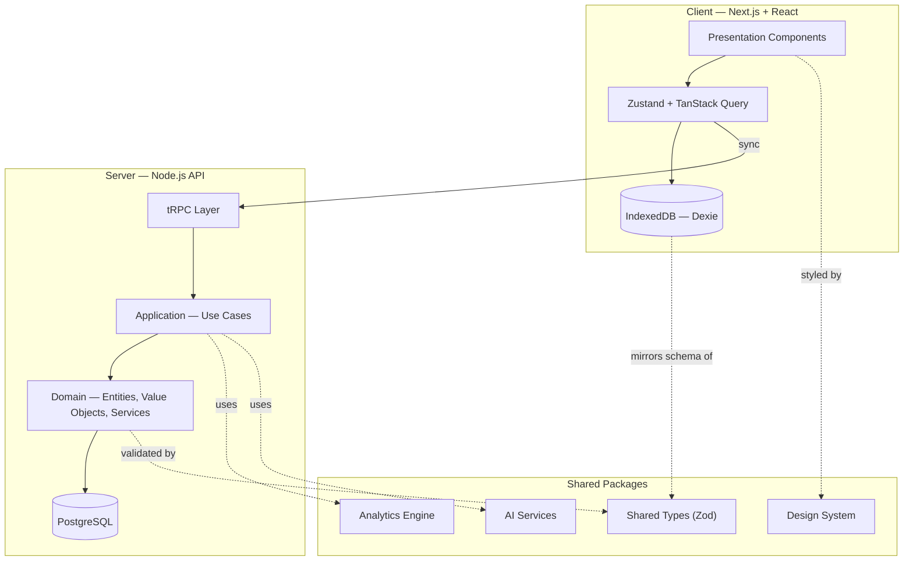

# TradeOS — System Architecture

**Phase 0 (Foundation): complete.** This document is the north star for every
phase that follows — read it before extending any package.

---

## 1. Vision & Product Principles

TradeOS is a personal trading journal and performance analytics platform
built to the standard of institutional trading software, not a hobbyist
spreadsheet replacement. Five principles drove every decision below:

1. **One domain model, everywhere.** A trade's net P&L is computed in
   exactly one place (`Trade.netPnL` in `@trading-os/domain`). The
   dashboard, the journal table, a PDF export, and an AI-generated review
   all read the *same* number — they can never silently disagree.
2. **Configuration over code.** Prop-firm rules, custom fields, dashboard
   layouts, and themes are data, not code. Supporting a new prop firm or a
   user's bespoke tracked field is a database record, never a deployment.
3. **Offline-first, sync-second.** Every write lands in the browser
   instantly; the network is an optimization, not a dependency.
4. **Strict layering.** Presentation code never computes a P&L figure or
   writes SQL. Domain code never imports React or Prisma. This is what
   keeps the system testable and lets any one layer be replaced (swap
   Next.js for something else; swap Postgres for something else) without
   touching business logic.
5. **Progressive, not big-bang.** The system is architected whole, then
   built module by module on a stable foundation — this document plus the
   packages under `packages/` are that foundation.

---

## 2. Tech Stack & Rationale

| Layer | Choice | Why |
|---|---|---|
| Frontend framework | Next.js 16 (App Router) + React 19 | Server components for fast initial loads on data-heavy screens, client components for the interactive dashboard/journal; one deployable app. |
| Language | TypeScript, strict mode everywhere | A trading platform's correctness bar is higher than most CRUD apps — `noUncheckedIndexedAccess` and no implicit `any` are non-negotiable. |
| Validation | Zod | Single source of truth for both runtime validation and static types (`z.infer`) — a schema changes once, not in three places. |
| Client state | Zustand (UI state) + TanStack Query (server state/cache) | Clean separation between "what the UI is doing" and "what the server said," which is where ad-hoc `useState` sprawl usually goes wrong. |
| Local persistence | IndexedDB via Dexie | The only realistic offline-capable structured store in a browser; wrapped behind the same repository port Postgres implements. |
| Server persistence | PostgreSQL via Prisma 7 | Trades and accounts are deeply relational with strong consistency needs (a broken foreign key here is a wrong P&L); Decimal columns avoid float drift at the DB layer, matching the `Money` value object's discipline in code. |
| Internal API | tRPC | End-to-end type safety between `apps/web` and `apps/api` with none of the schema-duplication REST/GraphQL would need for a single-product API. A REST/webhook surface is added later specifically for broker integrations, which do need a stable external contract. |
| Styling | Tailwind CSS v4 (CSS-first `@theme`) + Radix primitives + CVA | v4's CSS-first theming lets every design token live in one file and swap at runtime (see §7) with no JS rebuild; Radix supplies accessible primitive behavior; CVA keeps variant logic declarative. |
| Charts | Recharts (standard charts) + D3 (bespoke: calendar heatmap, Sankey, correlation matrix) | Recharts covers 80% of charts idiomatically in React; the remaining bespoke visualizations need D3's control. |
| Monorepo tooling | pnpm workspaces + Turborepo | Efficient installs, strict dependency boundaries (a package can't silently reach into another's `node_modules`), and cached/parallelized builds. |
| AI | Anthropic API, behind the `AIInsightService` port | Keeps every feature that touches AI decoupled from the specific provider — see `@trading-os/ai-services`. |

---

## 3. Architecture Pattern: DDD + Layered/Hexagonal



Four layers, each a real dependency boundary enforced by the package graph
(a package literally cannot import a package that isn't declared in its
`package.json`):

- **`shared-types`** — Zod schemas + inferred TS types. The innermost
  layer; every other package depends on it, it depends on nothing.
- **`domain`** — Entities (`Trade`, `TradingAccount`), value objects
  (`Money`), domain services (`ComplianceEvaluator`, `RiskEngine`), and
  repository *ports* (interfaces only — no implementation). Framework-free:
  no React, no Prisma, no HTTP. This is the package that encodes what
  "trading" actually means, independent of how it's stored or displayed.
- **`application`** — Use cases that orchestrate domain + repositories +
  analytics into one operation (`RecordTradeUseCase`,
  `EvaluateAccountComplianceUseCase`). This is the layer `apps/api`'s tRPC
  routers call into; it's also directly unit-testable with fake
  repositories, with no server running.
- **`infrastructure`** — Concrete implementations of the domain's
  repository ports: `persistence-postgres` (Prisma, server-side source of
  truth) and `persistence-indexeddb` (Dexie, client-side offline cache +
  sync outbox). Both satisfy the *same* `TradeRepository` interface, which
  is what lets the exact same application-layer use case run on either
  side of the network.

`design-system`, `analytics-engine`, and `ai-services` sit alongside as
shared capabilities rather than inside the vertical stack — every layer
that needs charts, formatted components, or AI-generated text pulls them
in directly.

---

## 4. Bounded Contexts

| Context | Owns | Primary entities |
|---|---|---|
| Identity & Access | Users, auth sessions | `User` |
| Account Management | Trading accounts, brokers, payouts | `TradingAccount`, `Payout` |
| Trade Journal | Trade records, executions, attachments | `Trade` |
| Risk Management | Position sizing, loss limits, drawdown monitoring | `RiskEngine` (domain service) |
| Prop Firm Compliance | Configurable rule sets, evaluation progress | `PropFirmRuleSet`, `ComplianceEvaluator` |
| Playbook | Strategies, setups, checklists, grading | `Strategy`, `Setup` |
| Psychology | Mood/discipline tracking, behavioral tags | `PsychologyEntry` |
| Analytics | Derived performance metrics, simulations | (read-model, computed — no owned entities) |
| Reporting | Export generation | (consumes Analytics + Trade Journal) |
| AI Insights | Coaching, pattern detection, summarization | `AIInsightService` port |
| Notifications | Alerts, reminders | `Notification`, `DomainEvent` |
| Settings/Personalization | Preferences, custom fields, layouts, themes | `CustomFieldDefinition`, `DashboardLayout` |
| Billing | Plans, usage limits | *(Phase 2+, not yet modeled)* |

A **shared kernel** — `Money`, date/range helpers, the `Threshold` value
object — is used across contexts without belonging to any one of them.

---

## 5. Data Flow: Local-First Write, Server-Authoritative Sync

1. User submits a trade in the UI → `RecordTradeUseCase.execute()` runs
   against the **IndexedDB** repository (`TradeRepositoryIndexedDB`).
2. The write completes in milliseconds; the UI updates immediately. No
   network round-trip is on the critical path for perceived speed.
3. The same write is appended to `syncQueue` (an outbox table) as a
   pending operation.
4. `drainSyncQueue()` — triggered on reconnect and on an interval while
   online — pushes queued operations to the backend API, which runs the
   *same* `RecordTradeUseCase` against the **Postgres** repository.
5. Postgres is the tie-breaker for multi-device conflicts (`updatedAt`
   comparison; last-write-wins for Phase 0, with a conflict-review UI
   planned once multi-device usage is common enough to need it).
6. Failed sync operations back off per-item (`attempts` counter) rather
   than blocking the rest of the outbox, and surface in a "sync issues"
   indicator once `MAX_ATTEMPTS` is exceeded rather than retrying forever.

This is why `TradeRepository` is a port in `domain` rather than a concrete
class: `RecordTradeUseCase` has no idea whether it's running against
IndexedDB or Postgres, and doesn't need to.

---

## 6. Domain Model Highlights

- **`Money`** stores amounts as integer minor units (cents) internally,
  never floats — the standard defense against P&L values that drift by
  fractions of a cent after thousands of trades' worth of arithmetic.
- **`Trade`** computes gross/net P&L, R-multiple (planned and achieved),
  exit efficiency (net P&L ÷ MFE — how much of the favorable move was
  actually captured), and MFE:MAE ratio, all as derived getters over a
  validated `TradeRecord`. Nothing above the domain layer re-implements
  this math.
- **`ComplianceEvaluator`** is fully data-driven: it evaluates an account
  against a `PropFirmRuleSetRecord` — daily loss limit, static/trailing
  max drawdown, profit target, minimum trading days, consistency rule —
  without any firm-specific code. A new prop firm, or a firm changing its
  terms, is a new database row.
- **`RiskEngine`** provides position sizing and a parametric Monte Carlo
  risk-of-ruin estimate; `@trading-os/analytics-engine`'s
  `runMonteCarloSimulation` complements it with a *bootstrap* simulation
  that resamples a trader's actual historical R-multiple distribution
  rather than assuming a fixed win rate — the difference between "what
  does a textbook trader's risk look like" and "what does *my* risk,
  warts and all, look like projected forward."
- **`analytics-engine`** is dependency-free by design (verified — see §9)
  so every ratio (Sharpe, Sortino, Calmar, Ulcer Index, recovery factor,
  expectancy) is a pure function, trivially unit-testable and safe to run
  in a web worker if a very large trade history ever makes it worth
  offloading from the main thread.

---

## 7. Design System

The visual language is deliberately **not** the default "Inter + violet
accent + dark mode" look common to AI-generated SaaS dashboards. Two
choices anchor it instead:

- **Typography:** IBM Plex Sans (interface) + IBM Plex Mono (all numeric
  values) — one coherent type family rather than two unrelated ones, with
  Plex's engineered character suiting an instrument panel. Every price,
  P&L figure, and percentage uses tabular figures so columns of numbers
  align exactly, the way a real trading terminal's price ladder does.
- **Color:** a deep navy base (not pure black) with a **brass/amber**
  signature accent — a deliberate reference to classic trading-terminal
  phosphor and ticker tape, reserved for brand moments and "live" state
  rather than splashed across every element. Profit/loss stay
  conventional green/red on purpose: that mapping is load-bearing muscle
  memory for anyone who trades, not a place to take a stylistic risk.

Tailwind v4's CSS-first `@theme` (see `packages/design-system/src/styles/theme.css`)
defines tokens as a two-layer indirection: `--color-brand: var(--tos-brand)`.
Utility classes reference the outer layer, which is generated once at
build time; the inner `--tos-*` values are re-declared per `[data-theme]`
selector. The practical effect: a user's theme switcher toggles
`data-theme` on `<html>` and the *entire app* re-themes instantly, with
zero JS re-render and zero CSS rebuild — required for a genuine
user-facing theme/customization system rather than a build-time-only dark
mode.

---

## 8. Security & Multi-Tenancy

- **Auth:** short-lived JWT access tokens + rotating refresh tokens in
  httpOnly, secure cookies (Phase 1+; not yet implemented in Phase 0).
- **Row-level scoping:** every Postgres query is scoped by `userId` (or
  eventually `organizationId`) at the application layer as defense in
  depth alongside any database-level policy — the schema indexes
  `[userId, ...]` throughout specifically to make this scoping cheap.
- **Validation at every trust boundary:** the same Zod schemas validate
  the client form, the tRPC input, and any CSV/broker import — one
  definition, checked in three places, not three definitions that can
  drift apart.
- **Encryption:** TLS in transit; broker API keys and other secrets
  encrypted at rest (envelope encryption via a KMS) rather than stored
  plaintext in Postgres.
- **Audit trail:** the `AuditLog` model captures sensitive mutations
  (rule set changes, payout records, account status changes) — who did
  what, when.
- **Least privilege for integrations:** broker/platform API connections
  request the narrowest scope the broker's API supports (read-only where
  available) rather than full trading permissions for a journal that only
  needs to read trade history.
- **Secrets management:** environment/secret-manager only, never
  committed — enforced by `.gitignore` from Phase 0 onward.

---

## 9. Testing Strategy

- **`domain` and `analytics-engine`:** pure functions and framework-free
  classes — Vitest unit tests, targeting near-100% coverage since there's
  no I/O to mock. `analytics-engine` was type-checked with zero
  dependencies and zero errors as part of this Phase 0 build (see the
  build log / package `package.json` — no `dependencies` field at all is
  the enforcement mechanism, not just a convention).
- **Repository implementations:** a single shared contract-test suite
  (not yet written — Phase 1) runs against both `persistence-postgres`
  (via Testcontainers) and `persistence-indexeddb` (via `fake-indexeddb`)
  to guarantee they satisfy the `TradeRepository` port identically.
- **Application use cases:** unit-tested against in-memory fake
  repositories — no database or browser required.
- **E2E:** Playwright, covering the critical paths (trade entry →
  dashboard reflects it; compliance evaluation → rule-violation alert
  fires) once `apps/web` exists.

---

## 10. Roadmap

- [x] **Phase 0 — Foundation.** Monorepo scaffold, `shared-types`,
      `domain`, `analytics-engine`, `application`, `design-system`
      tokens + primitives, `persistence-postgres` schema,
      `persistence-indexeddb` + sync engine, `ai-services` contract.
- [x] **Phase 1 — Dashboard.** `apps/web` (Next.js 16) scaffold; app shell
      (sidebar nav + topbar, theme toggle); widget engine on
      `react-grid-layout` (drag, resize, add/remove, reset, localStorage
      persistence — swaps to the `dashboard_layouts` table with zero
      widget-code changes once `apps/api` exists); six widgets (KPI grid,
      equity curve, drawdown, D3 calendar heatmap, win/loss donut, recent
      trades), all reading from one `getDashboardData()` loader that calls
      `GetPerformanceSummaryUseCase` and `TradingAccount`'s equity-curve/
      drawdown methods directly — no widget re-implements P&L math.
      `@trading-os/persistence-memory` added as a third `TradeRepository`
      implementation (alongside Postgres and IndexedDB) backing both this
      demo and future use-case unit tests. A seeded, deterministic demo
      dataset (68 realistic trades) makes every widget show real shapes
      rather than empty states.
- [x] **Phase 2 — Trade Journal.** Full tabbed trade-entry form
      (Details / Execution & Risk / Excursion & Review / Links) built with
      react-hook-form + the same `CreateTradeInputSchema` the server action
      and persistence layers validate against — one schema, not a parallel
      form-only definition. Take-profit levels as a real repeatable field
      array. Searchable/filterable/sortable trade table computed through
      the actual `Trade` domain entity (net P&L and R-multiple aren't
      recomputed in the UI). CSV import with flexible header-alias mapping
      (every row still validated through the identical Zod schema) and
      CSV export. Five new design-system primitives added along the way —
      Select, Tabs, Checkbox, Textarea, TagInput, Drawer — all reusable by
      Playbook and Accounts, not journal-specific one-offs. Mutations run
      through Next.js Server Actions calling `RecordTradeUseCase` directly,
      the same use case `apps/api` will call once it exists.
- [x] **Phase 3 — Accounts & Prop Firm Compliance.** Multi-account
      management (grid view, create/edit form) with a second demo account
      added specifically to prove "manage unlimited accounts separately"
      end to end. The compliance dashboard is a thin UI over
      `ComplianceEvaluator` from Phase 0 — every rule check, progress bar,
      and status badge reads directly off `RuleCheckResult`, nothing
      recomputed in the component. Added `calculateFundingReadinessScore`
      to `ComplianceEvaluator` (0-100, reuses the existing checks rather
      than a parallel calculation) and a rule-set template library — plain
      starting *data* for common prop-firm structures, not hardcoded
      per-firm code paths, consistent with "rules must be fully editable."
      Filled a gap from Phase 0: `PropFirmRuleSetRepository` and
      `PayoutRepository` ports were missing from `domain`; both now exist
      with in-memory implementations alongside a `ProgressBar` primitive
      added to the design system. Payout tracking (gross/split/net/date)
      completes the picture for funded accounts. Side-by-side account
      comparison is deferred to a later pass — noted here rather than
      silently dropped.
- [x] **Phase 4 — Playbook.** Strategy library with a genuinely reusable
      checklist editor (`ChecklistField`) powering entry rules, exit rules,
      confirmation checklist, and invalidation rules — one component, four
      checklists, not four hand-built forms. Added `calculateSetupScore` to
      `analytics-engine`: a statistical (not AI) 0-100 score that regresses
      toward a neutral 50 on small sample sizes rather than letting a
      3-trade 100%-win-rate setup read as elite — the same shrinkage logic
      behind rating systems that don't trust a 5-star product with one
      review. Filled another domain gap: `StrategyRepository` and
      `SetupRepository` ports were missing since Phase 0; both now exist
      with in-memory implementations. Demo strategies upgraded from name
      stubs to full records with real checklists, so the module has
      genuine content on first load. AI-generated setup grading
      (`AIInsightService.gradeSetup`, the port defined back in Phase 0)
      stays deferred to Phase 9 — this phase is the statistical foundation
      that grading will sit alongside, not replace.
- [x] **Phase 5 — Psychology module.** Daily check-in (mood, confidence,
      stress, discipline, patience, rule adherence — all Radix `Slider`,
      a new reusable primitive) and a genuine statistical correlation
      engine, not a placeholder: `correlatePsychologyWithPerformance`
      buckets days by a psychology rating and shows *real* win rate/net
      P&L differences across tiers — it will show nothing if there's
      nothing there, unlike a canned "insight." `calculateMistakeFrequency`
      ranks mistake categories by actual dollar cost, not just count. Demo
      psychology data was deliberately generated *correlated* with real
      daily trading outcomes (with realistic noise, not a perfect 1:1) so
      this module has a genuine signal to surface rather than random
      numbers. Filled the now-familiar gap: `PsychologyEntryRepository`
      port added to `domain` with an in-memory implementation. Re-verified
      after this addition: `analytics-engine` still compiles with zero
      errors and zero runtime dependencies — the "pure functions only"
      constraint from Phase 0 has held through five feature phases, not
      just the initial build.
- [x] **Phase 6 — Risk Management Center.** Live daily/weekly/monthly loss
      and drawdown monitoring per account, the position size + margin
      calculator, and a forex lot-size calculator — all running
      `RiskEngine` directly in the browser (pure domain logic, zero I/O,
      zero server round-trip needed for a calculator). Caught and fixed a
      real gap on review: `ComplianceEvaluator` had `weeklyLossLimit` and
      `monthlyLossLimit` in its schema since Phase 0 but never actually
      checked them — added `checkWeeklyLoss`/`checkMonthlyLoss`, mirroring
      the daily check with ISO-week/calendar-month date bucketing. Added
      `calculateMargin` and `calculateLotSize` to `RiskEngine`. Built the
      automatic warning system for real: `GenerateRiskAlertsUseCase` scans
      every account through the same `ComplianceEvaluator` the compliance
      dashboard uses and writes deduplicated notifications for anything at
      warning/breach — surfaced through a topbar bell visible from every
      screen, not buried on one page. Added the `Notification` shared-type
      schema (the Prisma model existed since Phase 0 but had no Zod
      counterpart until now) and its repository port.
- [x] **Phase 7 — Analytics deep-dive.** The "performance by X" drill-down
      (strategy, instrument, asset class, session, timeframe, day of week,
      month) reuses `groupTradesBy` from Phase 0 across seven dimensions
      rather than building seven bespoke aggregations. The Monte Carlo
      chart finally gives the bootstrap simulation engine (built Phase 0,
      unused until now) a UI — percentile bands over projected trade
      sequences, with probability-of-profit and probability-of-ruin read
      directly off the simulation output. Added genuine statistics, not a
      relabeled feature: `calculatePearsonCorrelation` and
      `calculateCorrelationMatrix` in `analytics-engine` compute real
      correlation coefficients between numeric trade attributes (duration,
      R-multiple, self-rating, MAE, MFE, size) — it answers "does my own
      confidence rating actually predict my results" with a real number,
      not a canned insight, and will show weak correlations if that's what
      the data says. Winners-vs-losers comparison sits alongside. Re-
      verified `analytics-engine` still compiles with zero errors and zero
      dependencies after this addition — the constraint has now held
      through six feature phases built on top of it.
- [x] **Phase 8 — Reports & export.** Real file generation, not stubs:
      `@react-pdf/renderer` produces the Performance Report and the Prop
      Firm Compliance Report as genuine PDFs (print-ready by construction —
      A4 page sizing, not a separate "print format"); `exceljs` produces
      formatted Tax Summary and Trade History workbooks (frozen header
      row, autofilter, conditional P&L coloring, real number formats, not
      bare CSV-in-a-spreadsheet). Every report's data-gathering function
      calls the same domain/application/analytics-engine layers every
      other module already uses — `getPerformanceReportData` is a thin
      orchestration layer, not a parallel metrics implementation. Files
      stream from Next.js Route Handlers with correct `Content-Type`/
      `Content-Disposition` headers rather than round-tripping through
      base64. Covers Performance, Prop Firm, Tax Summary, and Trade
      History from the original spec across PDF/Excel/JSON; Broker,
      Strategy, Psychology, and Risk reports are explicitly deferred,
      following the same established pattern (a data-gathering function
      plus a renderer) and noted as such in the UI rather than silently
      missing.
- [x] **Phase 9 — AI Insights & Automation.** `AIInsightService` — the
      port defined in Phase 0 and referenced-but-unimplemented in every
      phase since — finally has two real implementations, mirroring the
      persistence pattern established since Phase 0 (memory vs. Postgres):
      `AnthropicInsightService` calls Claude via forced tool-use for
      guaranteed structured output, validated against the same Zod schemas
      the rest of the app uses rather than trusting raw model output;
      `HeuristicInsightService` is a genuine, honest statistical fallback
      (not a fake stand-in) built entirely from `analytics-engine`
      functions already validated in earlier phases. `getInsightService()`
      is the single composition point that picks between them based on
      `ANTHROPIC_API_KEY` — every consumer depends only on the port, and
      the UI honestly labels which mode produced a given result via a
      `ModeBadge` rather than presenting both identically. Every prompt
      follows one rule throughout: the domain/analytics layers compute
      every number that has a correct deterministic answer, and Claude is
      asked only for qualitative judgment — never to recompute arithmetic
      it could get wrong. Four touchpoints ship on one AI Insights page:
      trade review, mistake pattern detection, setup grading, and
      journal summarization. Caught two genuine bugs this pass, not just
      cascading noise: the exact same invalid `as const`-on-a-ternary
      mistake fixed back in Phase 2 recurred in a new file (fixed the same
      way), and `ai-services` referenced `process.env` without declaring
      `@types/node` (added the dependency — the sandbox can't verify the
      fix locally since it can't install anything, but the declaration
      itself is now correct).
- [x] **Phase 10 — Settings, customization, billing, and auth hardening.**
      `CustomFieldDefinitionRepository` shipped with a real UI and, more
      importantly, is actually wired into the Trade Journal form from
      Phase 2: a field defined in Settings appears on the trade form
      immediately, no code change, no migration — the concrete proof of
      "fully customizable" rather than an aspirational claim in a doc.
      Accent-color customization (five curated presets, not a free-form
      picker that could produce unreadable button text) overrides the
      same `--tos-brand*` CSS variables `theme.css` has defined since
      Phase 0, applied at runtime with zero rebuild — the two-layer
      indirection documented in §7 finally has something real exercising
      it. A deliberate scope decision, stated plainly rather than left
      silent: full multi-user auth and billing are **not** built. Both get
      real domain ports (`AuthService` joins the port list this phase) and
      a documented plan, but no UI — a login screen that doesn't check
      credentials against a real user table, or a billing screen with no
      real customer record behind it, would be exactly the kind of
      placeholder this codebase has avoided in every other phase. They
      ship once `persistence-postgres` is wired to a real database and
      there's an actual account to secure or bill.

**This closes the original roadmap.** All ten phases are built, and
`analytics-engine` — the package with a zero-dependency constraint
declared in Phase 0 — still compiles with zero errors after nine feature
phases were layered on top of it. What's deliberately not here: a running
`apps/api` backend, real Postgres/IndexedDB wiring in place of the memory
repositories, and the auth/billing UI noted above. Every one of those has
a concrete, already-defined seam to attach to (a repository port, a
domain service, an application use case) rather than a gap that needs
architecture invented from scratch.

---

## 11. Monorepo Layout

```
trading-os/
├── apps/                              # empty in Phase 0 — see apps/README.md
│   ├── web/                           # Next.js 16 (Phase 1+)
│   └── api/                           # tRPC backend (Phase 1+)
├── packages/
│   ├── shared-types/                  # Zod schemas + inferred types
│   ├── domain/                        # Entities, value objects, domain services, ports
│   ├── analytics-engine/              # Pure statistical/performance functions
│   ├── application/                   # Use cases
│   ├── design-system/                 # Tokens, Tailwind v4 theme, primitives
│   ├── ai-services/                   # AIInsightService port
│   └── infrastructure/
│       ├── persistence-postgres/      # Prisma schema (source of truth)
│       └── persistence-indexeddb/     # Dexie (offline cache) + sync queue
├── turbo.json
├── pnpm-workspace.yaml
└── tsconfig.base.json
```
